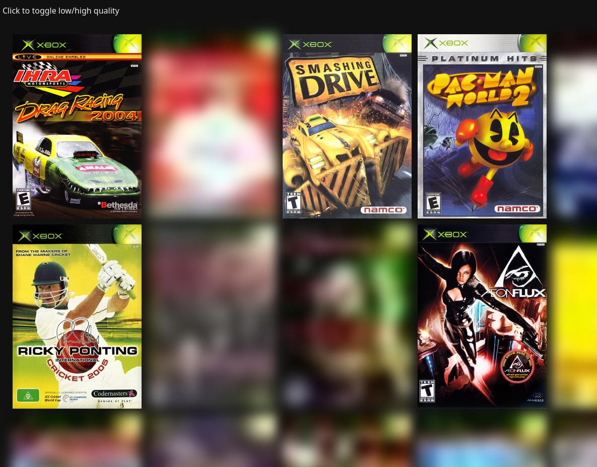

Low-Quality Image Placeholder Atlas
===================================

Demonstrates a technique for Low-Quality Image Placeholders (LQIP) that combines all placeholders into a single image and indexes parts of that image using CSS `background-image` with a blur filter until the higher quality image is loaded. Saves on requests, file overhead, custom decoding, etc.

The atlas generation is done with a Python script, everything else is vanilla CSS/Javascript.

This was done for https://xemu.app/#compatibility which shows 1000+ thumbnails on a page.

If you need images of non-uniform dimension in your atlas, check out https://github.com/mborgerson/textureatlas.

## Example

[Demo](https://mborgerson.github.io/lqip-atlas/)

Atlas


Webpage



Local hosting:

```bash
uv run build.py
python -m http.server
```
